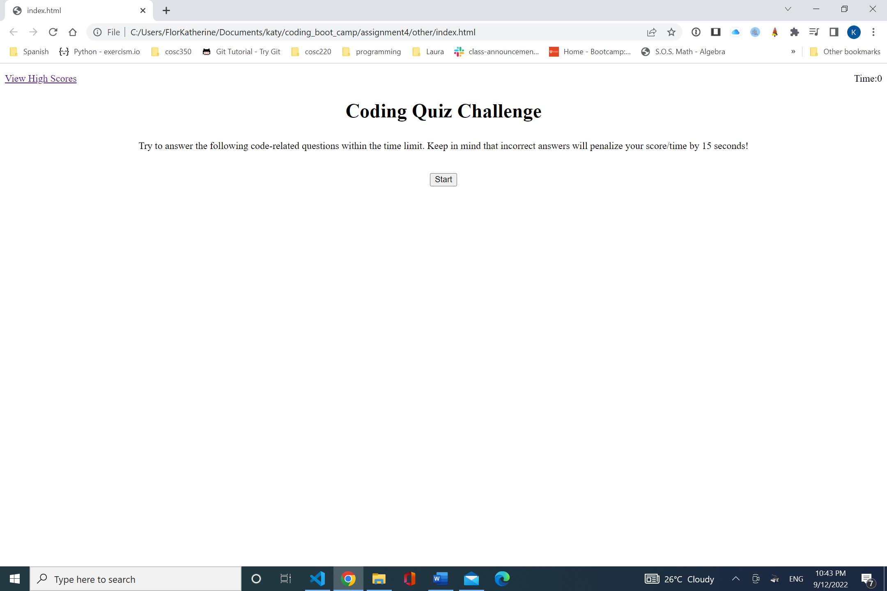
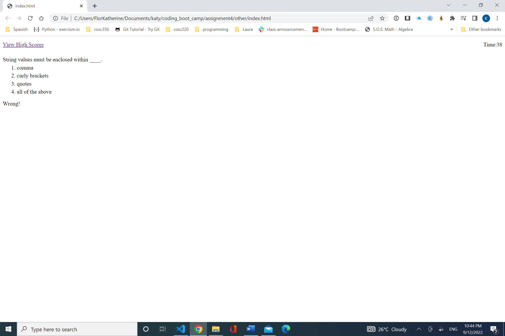
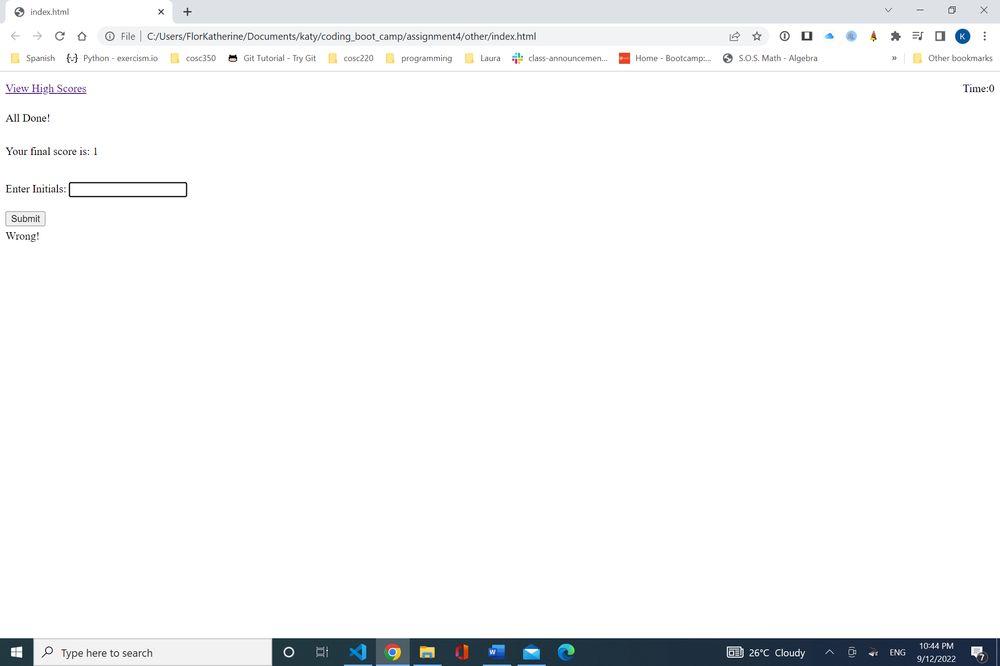
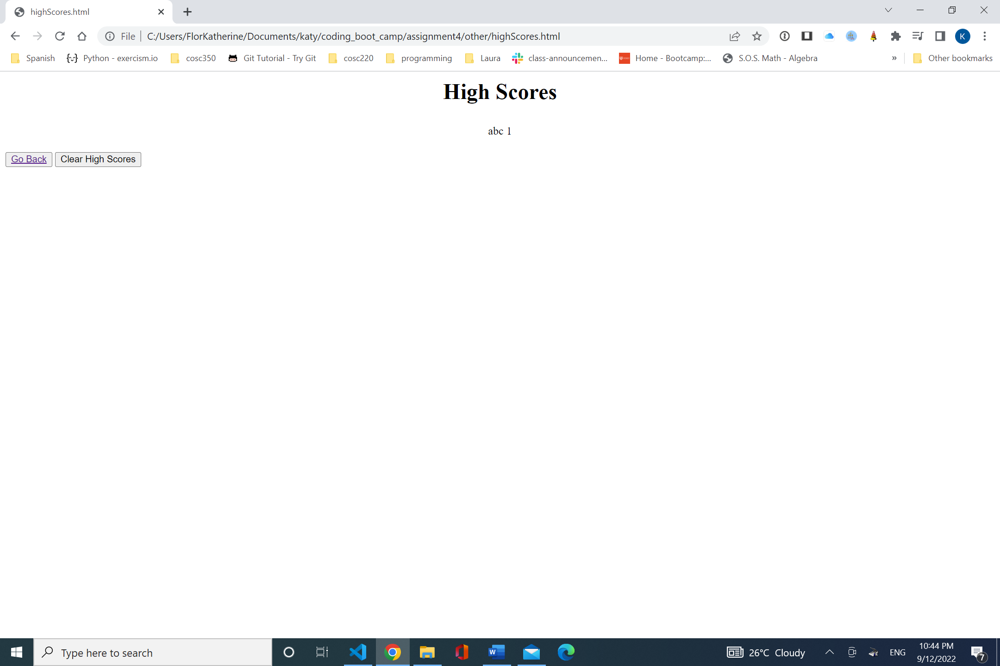

This program executes a quiz. and shows the instructions with timing on the first page along with the link
 to  view the High Scores.JAfter the start button is clicked,it shows the first question with their alternatives.
 When the user choose his/her alternative the program displays the next question and the result of the previous question with the timer
 decreasing by 15 secs if the answer chosen is wrong.
 After the questions/time are finished. The total score is displayed with an entry for the user to put his/her name.
 Finally the score and user name is store and all the user's scores are displayed. you can go back to do the quiz again or clear all the entries.

Below are some screenshots of the application running.

First we have the landing page:

Here is a question of the quiz:

This is the end of the quiz where you can submit your score:

This is a page where you can view high scores.

